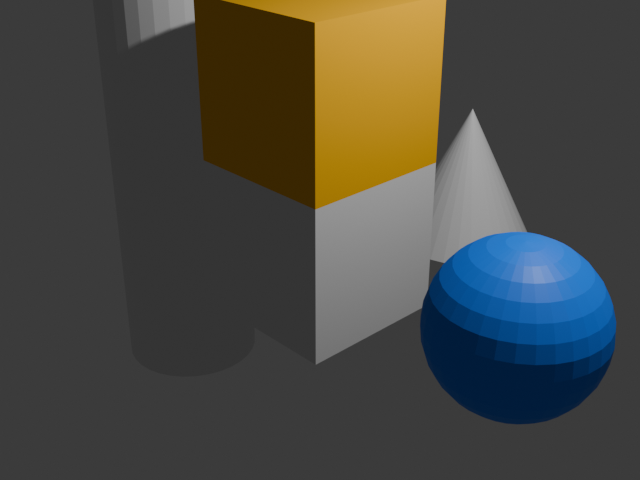

# Blender MCP Server

Control Blender from AI assistants like Claude Desktop using the [Model Context Protocol (MCP)](https://modelcontextprotocol.io).

**22 tools** across 6 namespaces — create objects, assign materials, render images, export scenes, and more, all through natural language.


*Scene above was created entirely through MCP commands: orange cube, blue sphere, stretched cylinder, and cone — with materials, transforms, and lighting.*

---

## How It Works

```
┌─────────────────┐      stdio       ┌─────────────────────┐    JSON/TCP     ┌──────────────────┐
│  Claude Desktop  │ ◄──────────────► │  MCP Server (Python) │ ◄────────────► │  Blender Add-on  │
│  (MCP Client)    │                  │  src/server.py       │  localhost:9876 │  (runs in Blender)│
└─────────────────┘                  └─────────────────────┘                 └──────────────────┘
```

1. The **Blender add-on** runs inside Blender, opening a TCP socket on `localhost:9876`
2. The **MCP server** connects to Claude Desktop via stdio and forwards tool calls to Blender over TCP
3. You talk to Claude → Claude calls MCP tools → Blender executes commands → results flow back

---

## Quick Start

### Step 1: Install the Blender Add-on

1. Open Blender
2. Go to **Edit → Preferences → Add-ons → Install**
3. Select `addon/__init__.py` from this repository
4. Enable **"Blender MCP Bridge"**
5. The TCP bridge starts automatically — you'll see "● Listening on 127.0.0.1:9876" in the sidebar panel

### Step 2: Install the MCP Server

```bash
pip install blender-mcp-server
```

Or from source:

```bash
git clone https://github.com/your-org/blender-mcp-server
cd blender-mcp-server
pip install -e .
```

### Step 3: Configure Claude Desktop

Add this to your Claude Desktop config file:

**macOS**: `~/Library/Application Support/Claude/claude_desktop_config.json`
**Windows**: `%APPDATA%\Claude\claude_desktop_config.json`
**Linux**: `~/.config/Claude/claude_desktop_config.json`

```json
{
  "mcpServers": {
    "blender": {
      "command": "blender-mcp-server"
    }
  }
}
```

Or with `uvx` (no install needed):

```json
{
  "mcpServers": {
    "blender": {
      "command": "uvx",
      "args": ["blender-mcp-server"]
    }
  }
}
```

### Step 4: Start Using It

1. Make sure Blender is running with the add-on enabled
2. Open Claude Desktop
3. Start asking Claude to work with your Blender scene!

---

## Example Prompts

Here's what you can ask Claude to do once everything is connected:

### 🔍 Inspecting Your Scene
> "What objects are in my scene?"
>
> "Show me the transform of the Camera object"
>
> "List all materials in the file"

### 🔨 Creating Objects
> "Create a sphere named 'Earth' at position [0, 0, 2] with size 3"
>
> "Add a cylinder at the origin, then scale it to [0.5, 0.5, 4] to make a tall pillar"
>
> "Create 5 cubes in a row spaced 3 units apart"

### 🎨 Materials & Colors
> "Create a red material and assign it to the Cube"
>
> "Make a material called 'Ocean' with color [0.0, 0.3, 0.8] and assign it to the Sphere"
>
> "Change the color of 'RedMaterial' to orange"

### 📐 Transforming Objects
> "Move the Cube up 2 units on the Z axis"
>
> "Rotate the Cylinder 45 degrees on the Z axis"
>
> "Scale the Sphere to [2, 2, 2]"

### 📸 Rendering & Exporting
> "Render the scene at 1920x1080 and save it to /tmp/render.png"
>
> "Export the scene as a GLB file to /tmp/scene.glb"

### ⏪ Safety
> "Undo the last change"
>
> "Redo what was just undone"

---

## Example Session

Here's a real session transcript showing every category of tool in action.
All output below was produced by a live Blender 4.0.2 instance controlled through the MCP bridge:

```
📋 STEP 1: Get Scene Info
─────────────────────────
{
  "name": "Scene",
  "frame_current": 1,
  "frame_start": 1,
  "frame_end": 250,
  "render_engine": "BLENDER_EEVEE",
  "resolution_x": 1920,
  "resolution_y": 1080,
  "object_count": 3
}

📦 STEP 2: List Default Scene Objects
──────────────────────────────────────
  • Cube            (MESH    ) at [0.0, 0.0, 0.0]
  • Light           (LIGHT   ) at [4.1, 1.0, 5.9]
  • Camera          (CAMERA  ) at [7.4, -6.9, 5.0]

🔨 STEP 3: Create Mesh Objects
───────────────────────────────
  ✅ Created MyCube          at [0.0, 0.0, 0.0]
  ✅ Created MySphere        at [3.0, 0.0, 0.0]
  ✅ Created MyCylinder      at [-3.0, 0.0, 0.0]
  ✅ Created MyCone          at [0.0, 3.0, 0.0]

🔄 STEP 4: Transform Objects
─────────────────────────────
  ✅ Moved MyCube to [0.0, 0.0, 2.0]
  ✅ Rotated MySphere Z=45°
  ✅ Scaled MyCylinder to [1.0, 1.0, 3.0]

📑 STEP 5: Duplicate Object
────────────────────────────
  ✅ Duplicated 'MyCube' → 'MyCube.Copy'

📐 STEP 6: Inspect Object Transform
────────────────────────────────────
{
  "name": "MyCube",
  "location": [0.0, 0.0, 2.0],
  "rotation_euler": [0.0, 0.0, 0.0],
  "scale": [1.0, 1.0, 1.0]
}

🎨 STEP 7: Create & Assign Materials
─────────────────────────────────────
  ✅ Created 'RedMaterial'
  ✅ Assigned 'RedMaterial' → 'MyCube'
  ✅ Created 'BlueMaterial'
  ✅ Assigned 'BlueMaterial' → 'MySphere'
  ✅ Changed RedMaterial color → orange

🎨 STEP 8: List Materials
─────────────────────────
  • BlueMaterial          (nodes: True, users: 1)
  • Material              (nodes: True, users: 1)
  • RedMaterial           (nodes: True, users: 1)

🌳 STEP 9: Scene Hierarchy
───────────────────────────
  • Cube (MESH)       • MyCube (MESH)
  • Light (LIGHT)     • MySphere (MESH)
  • Camera (CAMERA)   • MyCylinder (MESH)
                      • MyCone (MESH)

🗑️  STEP 10: Delete Object
──────────────────────────
  ✅ Deleted 'MyCube.Copy'

📸 STEP 12: Render Still Image
───────────────────────────────
  ✅ Rendered: /tmp/blender_mcp_render.png
     Engine: BLENDER_EEVEE, Resolution: [640, 480]

⏪ STEP 13: Undo & Redo
───────────────────────
  ✅ undo
  ✅ redo

📦 FINAL: Scene Summary — 7 objects, 3 materials
```

---

## Tool Reference

### Scene Inspection
| Tool | Description |
|---|---|
| `blender_scene_get_info` | Scene metadata — name, frame range, render engine, resolution, object count |
| `blender_scene_list_objects` | List all objects, optionally filter by type (`MESH`, `CAMERA`, `LIGHT`, etc.) |
| `blender_object_get_transform` | Get position, rotation, and scale of an object by name |
| `blender_object_get_hierarchy` | Parent/child hierarchy tree (full scene or subtree) |

### Materials
| Tool | Description |
|---|---|
| `blender_material_list` | List all materials in the file |
| `blender_material_create` | Create a new material with optional base color `[r, g, b]` (0–1) |
| `blender_material_assign` | Assign a material to an object |
| `blender_material_set_color` | Set the Principled BSDF base color |
| `blender_material_set_texture` | Set an image texture as base color |

### Object Manipulation
| Tool | Description |
|---|---|
| `blender_object_create` | Create primitives: `cube`, `sphere`, `cylinder`, `plane`, `cone`, `torus` |
| `blender_object_delete` | Delete an object by name |
| `blender_object_translate` | Move — absolute `location` or relative `offset` |
| `blender_object_rotate` | Set rotation `[x, y, z]` in degrees (default) or radians |
| `blender_object_scale` | Set scale `[x, y, z]` |
| `blender_object_duplicate` | Duplicate with optional new name |

### Rendering & Export
| Tool | Description |
|---|---|
| `blender_render_still` | Render still image — set output path, resolution, engine |
| `blender_render_animation` | Render animation — set frame range, output path, engine |
| `blender_export_gltf` | Export as glTF/GLB |
| `blender_export_obj` | Export as OBJ |
| `blender_export_fbx` | Export as FBX |

### History
| Tool | Description |
|---|---|
| `blender_history_undo` | Undo the last operation |
| `blender_history_redo` | Redo the last undone operation |

---

## Safety Features

- **Automatic undo push** — every mutation tool pushes an undo step first, so you can always roll back
- **Safe Mode** — enable in add-on preferences to restrict file access to the project directory only
- **Tool whitelist** — limit which commands the bridge will accept
- **No arbitrary code execution** — the bridge only accepts predefined commands, never `exec` or `eval`

---

## Add-on Preferences

In Blender → Edit → Preferences → Add-ons → Blender MCP Bridge:

| Setting | Description | Default |
|---|---|---|
| **Safe Mode** | Restrict file I/O to project directory | Off |
| **Port** | TCP port for the MCP bridge | 9876 |

---

## Headless / Background Mode

You can also run Blender in background mode (no GUI) for automation:

```bash
blender -b --python your_script.py
```

Where `your_script.py` starts the MCP bridge:

```python
import sys
sys.path.insert(0, "/path/to/blender-mcp-server")
from addon import CommandHandler, BlenderMCPServer

server = BlenderMCPServer()
server.start()

# Keep Blender alive (use your preferred method)
import socket
s = socket.socket()
s.bind(("127.0.0.1", 9877))
s.listen(1)
s.accept()  # Blocks until shutdown signal
```

---

## Development

```bash
# Clone and install with dev dependencies
git clone https://github.com/your-org/blender-mcp-server
cd blender-mcp-server
pip install -e ".[dev]"

# Run tests (no Blender required)
pytest tests/ -v
```

### Project Structure

```
blender-mcp-server/
├── addon/
│   └── __init__.py          # Blender add-on — TCP server + command handlers
├── src/blender_mcp_server/
│   ├── __init__.py
│   └── server.py            # MCP server — stdio transport + 22 tool definitions
├── tests/
│   ├── test_addon.py        # Add-on tests (mocked bpy)
│   └── test_server.py       # MCP server tests
├── docs/
│   ├── architecture.md      # Architecture documentation
│   └── images/
│       └── demo_render.png  # Render from demo session
├── pyproject.toml
└── README.md
```

---

## Contributing

1. Fork the repository
2. Create a feature branch
3. Make your changes with tests
4. Run `pytest tests/ -v` to verify all 23 tests pass
5. Submit a pull request

---

## License

MIT
