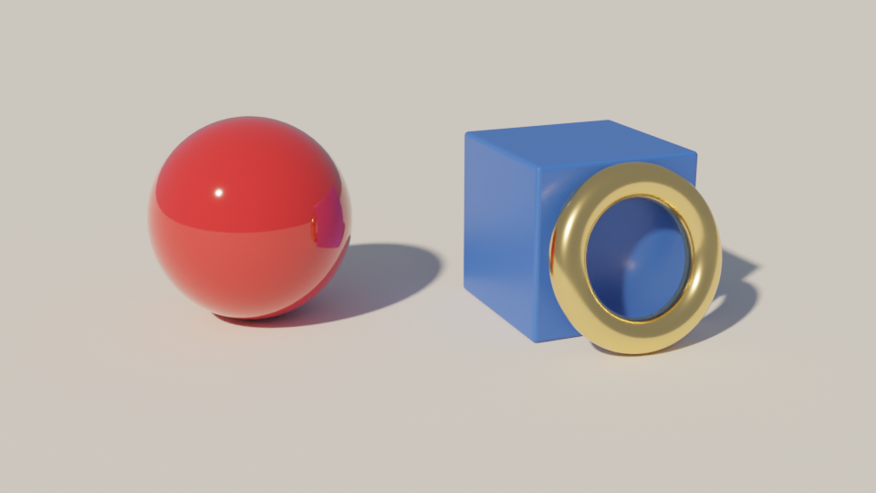
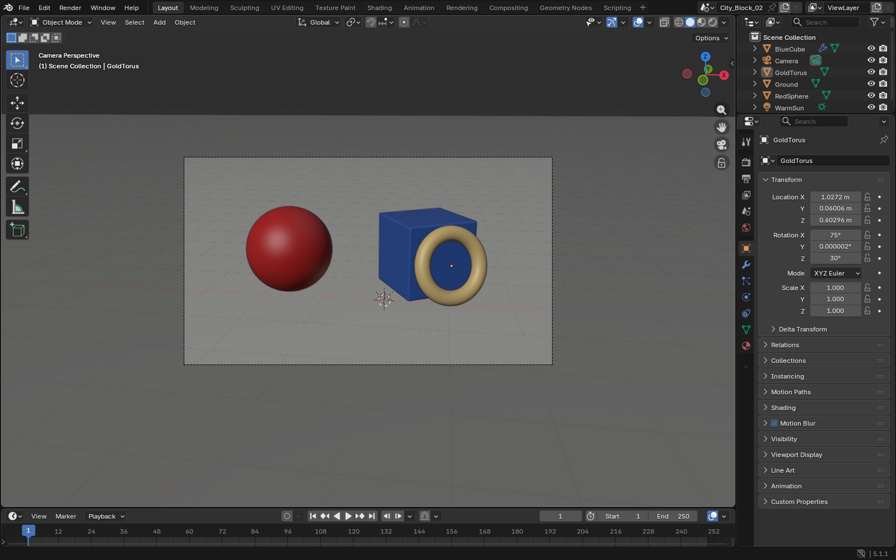

# Demo 1 — Still life from a sentence

Build a small scene with the object, material, and render tools, then render it.

## Prompt

<!-- prompt:start -->
```text
Start from an empty Blender scene (delete everything that is there). Build a small still life:
a large matte off-white ground plane, a glossy red sphere, a blue cube rotated 30 degrees around Z,
and a gold torus leaning against the cube. Add a warm sun light and a camera that frames all three
objects nicely. Render it with Cycles (64 samples) at 960x540 to /tmp/blender-mcp-demos/01-still-life.png.
Keep the scene open in Blender and briefly tell me what you built.
```
<!-- prompt:end -->

## Result

| Render (written by the agent) | Blender afterwards |
|---|---|
|  |  |

## Run it yourself, no AI

[`scripts/01_still_life.py`](scripts/01_still_life.py) builds the same kind of scene deterministically. It is plain
Blender Python, so you can also paste it into Blender's **Scripting** tab and press **Run**.

```bash
scripts/run_demo.sh 1                   # open Blender, build the scene and render it
scripts/run_demo.sh --background 1      # render only, no window
scripts/run_demo.sh --bridge 1          # send it to the Blender started by scripts/start.sh
scripts/run_demo.sh --background 1 --samples 16
```

Output: `/tmp/blender-mcp-demos/script-01-still-life.png`. The `--bridge` mode runs the script through the same
`python.execute` command an AI's `blender_python_exec` call uses, which makes it a quick way to check
the bridge without an AI client.

## What the agent did

<!-- record:start -->
Recorded 2026-09-23 with **claude** `2.1.280 (Claude Code)` (model `claude-opus-5-5[1m]`). 4 Blender tool calls, 57 s end to end.

### Tool calls

1. `blender_python_exec` — Python, 83 lines
2. `blender_render_still` `{"output_path": "/tmp/blender-mcp-demos/01-still-life.png", "engine": "CYCLES", "resolution_x": 960, "resolution_y": 540}`
3. `blender_python_exec` — Python, 2 lines
4. `blender_render_still` `{"output_path": "/tmp/blender-mcp-demos/01-still-life.png", "engine": "CYCLES", "resolution_x": 960, "resolution_y": 540}`

<details><summary>Largest Python script the agent ran</summary>

```python
import bpy, math
from mathutils import Vector

# Empty the scene
for ob in list(bpy.data.objects):
    bpy.data.objects.remove(ob, do_unlink=True)
for coll in (bpy.data.meshes, bpy.data.materials, bpy.data.lights, bpy.data.cameras):
    for b in list(coll):
        if b.users == 0:
            coll.remove(b)

scene = bpy.context.scene

def mat(name, color, rough, metal=0.0, coat=0.0):
    m = bpy.data.materials.new(name)
    m.use_nodes = True
    b = m.node_tree.nodes["Principled BSDF"]
    b.inputs["Base Color"].default_value = (*color, 1)
    b.inputs["Roughness"].default_value = rough
    b.inputs["Metallic"].default_value = metal
    if coat and "Coat Weight" in b.inputs:
        b.inputs["Coat Weight"].default_value = coat
    return m

m_ground = mat("Ground_Matte", (0.8, 0.78, 0.74), 0.9)
m_red = mat("Red_Glossy", (0.7, 0.03, 0.03), 0.08, coat=1.0)
m_blue = mat("Blue_Cube", (0.05, 0.15, 0.6), 0.35)
m_gold = mat("Gold", (1.0, 0.72, 0.3), 0.2, metal=1.0)

# Ground
bpy.ops.mesh.primitive_plane_add(size=40, location=(0, 0, 0))
g = bpy.context.object; g.name = "Ground"; g.data.materials.append(m_ground)

# Sphere
bpy.ops.mesh.primitive_uv_sphere_add(radius=0.7, location=(-1.6, 0.3, 0.7), segments=64, ring_count=32)
s = bpy.context.object; s.name = "RedSphere"; s.data.materials.append(m_red)
bpy.ops.object.shade_smooth()

# Cube, rotated 30 deg about Z
cube_c = Vector((0.6, 0.8, 0.6))
bpy.ops.mesh.primitive_cube_add(size=1.2, location=cube_c, rotation=(0, 0, math.radians(30)))
c = bpy.context.object; c.name = "BlueCube"; c.data.materials.append(m_blue)
bev = c.modifiers.new("Bevel", "BEVEL"); bev.width = 0.03; bev.segments = 3

# Torus leaning against the cube's front (-Y local) face, tilted 15 deg from vertical
R, r, tilt = 0.5, 0.12, math.radians(75)
local = Vector((0, -0.6 - (R*math.cos(tilt) + r) - 0.005, R*math.sin(tilt) + r))
rotz = math.radians(30)
world = Vector((local.x*math.cos(rotz) - local.y*math.sin(rotz),
                local.x*math.sin(rotz) + local.y*math.cos(rotz), local.z)) + Vector((cube_c.x, cube_c.y, 0))
bpy.ops.mesh.primitive_torus_add(major_radius=R, minor_radius=r, major_segments=96, minor_segments=32,
                                 location=world, rotation=(tilt, 0, rotz))
t = bpy.context.object; t.name = "GoldTorus"; t.data.materials.append(m_gold)
bpy.ops.object.shade_smooth()

# Warm sun
ld = bpy.data.lights.new("WarmSun", "SUN")
ld.energy = 4.0; ld.color = (1.0, 0.85, 0.65); ld.angle = math.radians(3)
sun = bpy.data.objects.new("WarmSun", ld); scene.collection.objects.link(sun)
sun.rotation_euler = (math.radians(50), math.radians(10), math.radians(-35))

# World: soft cool fill
w = scene.world or bpy.data.worlds.new("World"); scene.world = w
w.use_nodes = True
bg = w.node_tree.nodes["Background"]
bg.inputs["Color"].default_value = (0.55, 0.62, 0.75, 1); bg.inputs["Strength"].default_value = 0.35

# Camera
cd = bpy.data.cameras.new("Camera"); cd.lens = 50
cam = bpy.data.objects.new("Camera", cd); scene.collection.objects.link(cam)
cam.location = (0.8, -7.5, 3.0)
target = Vector((-0.3, 0.3, 0.55))
cam.rotation_euler = (target - cam.location).to_track_quat('-Z', 'Y').to_euler()
scene.camera = cam

# Render settings
scene.render.engine = 'CYCLES'
scene.cycles.samples = 64
scene.cycles.use_denoising = True
scene.render.resolution_x = 960; scene.render.resolution_y = 540; scene.render.resolution_percentage = 100
scene.view_settings.view_transform = 'AgX' if 'AgX' in [i.identifier for i in scene.view_settings.bl_rna.properties['view_transform'].enum_items] else 'Filmic'

__result__ = {"objects": [o.name for o in scene.objects], "torus_loc": list(world)}
```

</details>

### Agent's reply

> I cleared the Blender scene, built the still life and rendered it with Cycles at 64 samples, 960×540, to `/tmp/blender-mcp-demos/01-still-life.png`. I looked at the render and it came out clean. The scene is still open in Blender.
>
> **What's in the scene:**
> - **Ground:** a large matte off-white plane (rough, not shiny). After the first render I made it bigger so the horizon line no longer shows in the frame.
> - **Red sphere:** radius 0.7, glossy red with a clear-coat finish, sitting on the left.
> - **Blue cube:** 1.2 units on a side, rotated 30° around Z, with slightly rounded edges.
> - **Gold torus:** a shiny gold ring standing on the floor and leaning about 15° against the cube's front face.
> - **Lighting:** a warm orange-tinted sun from the upper left, casting soft shadows to the right. A faint cool-blue background glow fills in the shadows.
> - **Camera:** a 50mm lens placed in front and a little above, looking down at all three objects.
>
> I also turned on noise reduction and used Blender's AgX color setting for more natural highlights. Neither was in your request.
<!-- record:end -->
