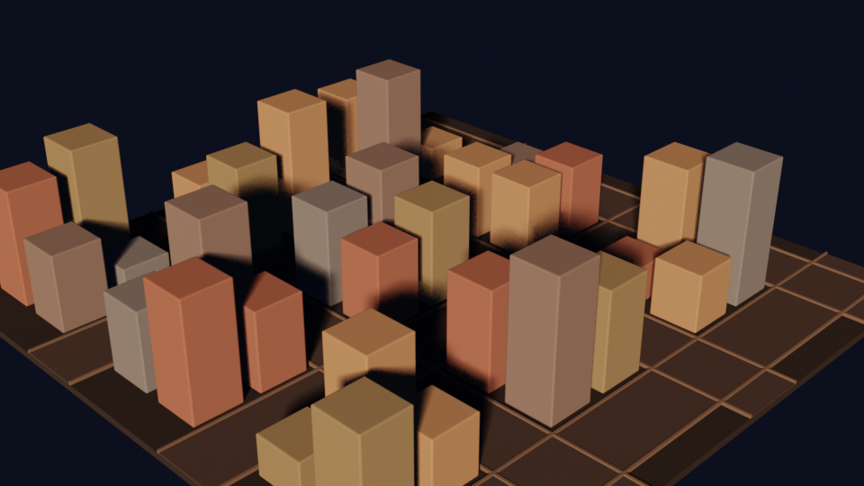
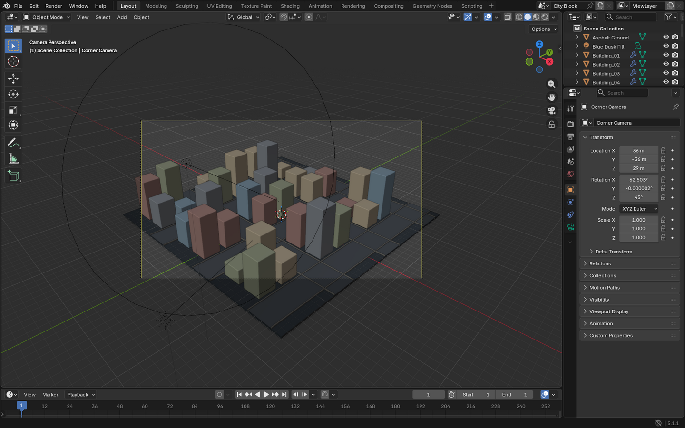

# Demo 2 — Procedural city with Python

Hand the agent a generative task; it writes and runs Python inside Blender with `blender_python_exec`.

## Prompt

<!-- prompt:start -->
```text
Start from an empty Blender scene (delete everything that is there). Using Python in Blender, generate a
small city block: a 9x9 grid of box buildings with random heights between 1 and 7 metres (use a fixed
random seed so it is reproducible), leave one-cell-wide streets every third row and column, and give the
buildings a few muted colours plus a dark asphalt ground. Add a low sunset sun and a camera looking
across the block from a corner at a slightly elevated angle. Render with EEVEE at 960x540 to
/tmp/blender-mcp-demos/02-city.png. Keep the scene open in Blender and tell me how many buildings you made.
```
<!-- prompt:end -->

## Result

| Render (written by the agent) | Blender afterwards |
|---|---|
|  |  |

## Run it yourself, no AI

[`scripts/02_procedural_city.py`](scripts/02_procedural_city.py) builds the same kind of scene deterministically. It is plain
Blender Python, so you can also paste it into Blender's **Scripting** tab and press **Run**.

```bash
scripts/run_demo.sh 2                   # open Blender, build the scene and render it
scripts/run_demo.sh --background 2      # render only, no window
scripts/run_demo.sh --bridge 2          # send it to the Blender started by scripts/start.sh
scripts/run_demo.sh --background 2 --seed 3
```

Output: `/tmp/blender-mcp-demos/script-02-city.png`. The `--bridge` mode runs the script through the same
`python.execute` command an AI's `blender_python_exec` call uses, which makes it a quick way to check
the bridge without an AI client.

## What the agent did

<!-- record:start -->
Recorded 2026-09-23 with **codex** `codex-cli 0.155.1`. 3 Blender tool calls.

### Tool calls

1. `blender_python_exec` `{"transport": "bridge", "timeout_seconds": 120}` — Python, 192 lines
2. `blender_python_exec` `{"transport": "bridge", "timeout_seconds": 120}` — Python, 52 lines
3. `blender_scene_get_info`

<details><summary>Largest Python script the agent ran</summary>

```python
import bpy
import math
import os
import random
from mathutils import Vector

# Start from a completely empty scene.
for obj in list(bpy.data.objects):
    bpy.data.objects.remove(obj, do_unlink=True)

scene = bpy.context.scene
scene.name = "City Block"
scene.frame_start = 1
scene.frame_end = 1
scene.frame_set(1)

# Remove old materials so the new scene is self-contained.
for mat in list(bpy.data.materials):
    bpy.data.materials.remove(mat)

def make_material(name, color, roughness=0.82, metallic=0.0):
    mat = bpy.data.materials.new(name)
    mat.diffuse_color = (*color, 1.0)
    mat.use_nodes = True
    bsdf = mat.node_tree.nodes.get("Principled BSDF")
    if bsdf:
        bsdf.inputs["Base Color"].default_value = (*color, 1.0)
        bsdf.inputs["Roughness"].default_value = roughness
        bsdf.inputs["Metallic"].default_value = metallic
    return mat

# Muted building palette.
building_mats = [
    make_material("Muted Terracotta", (0.46, 0.27, 0.24)),
    make_material("Dusty Blue", (0.27, 0.38, 0.47)),
    make_material("Olive Concrete", (0.39, 0.42, 0.29)),
    make_material("Warm Sand", (0.58, 0.48, 0.34)),
    make_material("Slate Grey", (0.30, 0.32, 0.35)),
]
asphalt = make_material("Dark Asphalt", (0.035, 0.045, 0.055), roughness=0.96)
road_mat = make_material("Road Surface", (0.065, 0.072, 0.082), roughness=0.93)
curb_mat = make_material("Warm Concrete Curbs", (0.23, 0.22, 0.20), roughness=0.9)

def add_box(name, location, dimensions, material, bevel=0.0):
    bpy.ops.mesh.primitive_cube_add(location=location)
    obj = bpy.context.object
    obj.name = name
    obj.dimensions = dimensions
    bpy.ops.object.transform_apply(location=False, rotation=False, scale=True)
    if material:
        obj.data.materials.append(material)
    if bevel:
        modifier = obj.modifiers.new("Soft box edges", "BEVEL")
        modifier.width = bevel
        modifier.segments = 2
        modifier.limit_method = "ANGLE"
    return obj

# Grid/road layout: 9x9 cells, with every third row and column reserved for streets.
n = 9
cell = 3.4
building_size = 2.55
street_indices = {2, 5, 8}
ground_size = n * cell + 3.0

# Ground slab and the street grid.
add_box("Asphalt Ground", (0.0, 0.0, -0.18), (ground_size, ground_size, 0.36), asphalt)
for idx in sorted(street_indices):
    coord = (idx - (n - 1) / 2.0) * cell
    add_box("Street_Row_%02d" % idx, (0.0, coord, 0.025), (ground_size, cell, 0.05), road_mat)
    add_box("Street_Col_%02d" % idx, (coord, 0.0, 0.03), (cell, ground_size, 0.06), road_mat)

# Subtle curbs along the road edges help the streets read from the camera.
for idx in sorted(street_indices):
    coord = (idx - (n - 1) / 2.0) * cell
    for offset in (-cell / 2.0 - 0.055, cell / 2.0 + 0.055):
        add_box("Curb_Row_%02d_%s" % (idx, "A" if offset < 0 else "B"),
                (0.0, coord + offset, 0.08), (ground_size, 0.11, 0.16), curb_mat)
        add_box("Curb_Col_%02d_%s" % (idx, "A" if offset < 0 else "B"),
                (coord + offset, 0.0, 0.08), (0.11, ground_size, 0.16), curb_mat)

# Reproducible city population.
rng = random.Random(1729)
building_count = 0
building_heights = []
for row in range(n):
    for col in range(n):
        if row in street_indices or col in street_indices:
            continue
        height = rng.randint(1, 7)
        x = (col - (n - 1) / 2.0) * cell
        y = (row - (n - 1) / 2.0) * cell
        material = building_mats[rng.randrange(len(building_mats))]
        add_box(
            "Building_%02d" % (building_count + 1),
            (x, y, height / 2.0),
            (building_size, building_size, float(height)),
            material,
            bevel=0.07,
        )
        building_heights.append(height)
        building_count += 1

# World: a dim violet-blue dusk to complement the warm sun.
world = scene.world
if world is None:
    world = bpy.data.worlds.new("Sunset World")
    scene.world = world
world.use_nodes = True
bg = world.node_tree.nodes.get("Background")
if bg:
    bg.inputs["Color"].default_value = (0.018, 0.025, 0.055, 1.0)
    bg.inputs["Strength"].default_value = 0.22

def point_at(obj, target):
    direction = Vector(target) - obj.location
    obj.rotation_euler = direction.to_track_quat("-Z", "Y").to_euler()

# Low, warm sunset sun.
bpy.ops.object.light_add(type="SUN", location=(-24.0, -28.0, 16.0))
sun = bpy.context.object
sun.name = "Low Sunset Sun"
sun.data.energy = 3.2
sun.data.angle = math.radians(9.0)
sun.data.color = (1.0, 0.43, 0.22)
point_at(sun, (0.0, 0.0, 0.0))

# Cool, very soft fill keeps the shadow-side facades readable.
bpy.ops.object.light_add(type="AREA", location=(4.0, -8.0, 24.0))
fill = bpy.context.object
fill.name = "Blue Dusk Fill"
fill.data.energy = 260.0
fill.data.shape = "DISK"
fill.data.size = 18.0
fill.data.color = (0.20, 0.28, 0.46)
point_at(fill, (0.0, 0.0, 0.0))

# Camera across the block from a corner, slightly elevated.
bpy.ops.object.camera_add(location=(31.0, -31.0, 25.0))
camera = bpy.context.object
camera.name = "Corner Camera"
camera.data.lens = 52.0
camera.data.sensor_width = 36.0
camera.data.clip_end = 200.0
point_at(camera, (0.0, 1.0, 3.0))
scene.camera = camera

# EEVEE render settings.
try:
    scene.render.engine = "BLENDER_EEVEE_NEXT"
except Exception:
    scene.render.engine = "BLENDER_EEVEE"
scene.render.resolution_x = 960
scene.render.resolution_y = 540
scene.render.resolution_percentage = 100
scene.render.image_settings.file_format = "PNG"
scene.render.film_transparent = False
scene.render.image_settings.color_mode = "RGBA"
try:
    scene.render.image_settings.color_depth = "8"
except Exception:
    pass
try:
    scene.eevee.use_gtao = True
    scene.eevee.gtao_distance = 3.0
    scene.eevee.gtao_factor = 1.35
except Exception:
    pass
try:
    scene.view_settings.look = "AgX - Medium High Contrast"
except Exception:
    pass

output_path = "/tmp/blender-mcp-demos/02-city.png"
os.makedirs(os.path.dirname(output_path), exist_ok=True)
scene.render.filepath = output_path

# Keep the live scene open and render the requested still.
bpy.context.view_layer.objects.active = camera
camera.select_set(True)
bpy.ops.render.render(write_still=True)

__result__ = {
    "building_count": building_count,
    "height_min": min(building_heights),
    "height_max": max(building_heights),
    "street_rows_columns": sorted(street_indices),
    "render_path": output_path,
    "render_engine": scene.render.engine,
    "resolution": [scene.render.resolution_x, scene.render.resolution_y],
    "total_objects": len(bpy.data.objects),
}
```

</details>

### Agent's reply

> Done. I created and rendered the city block in Blender with 36 buildings using fixed seed `1729`.
>
> - Render: 02-city.png
> - Resolution: 960×540
> - Engine: EEVEE
> - Scene remains open in Blender.
<!-- record:end -->
