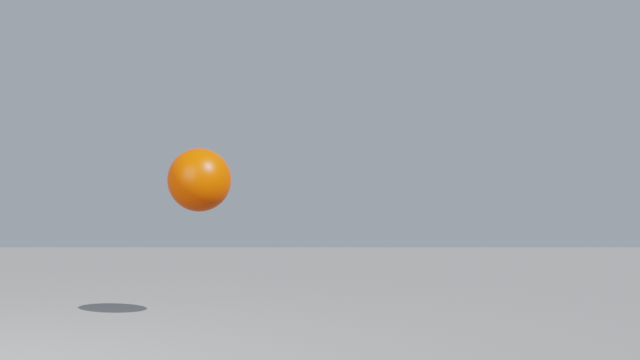
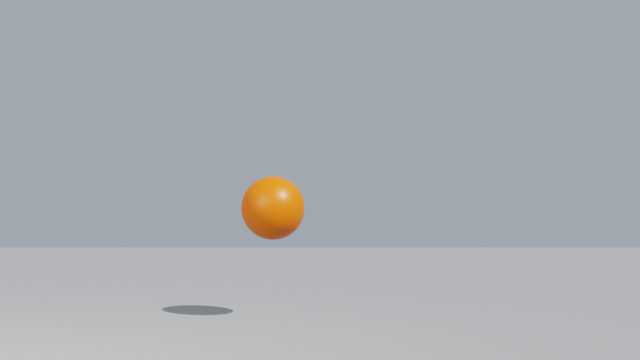
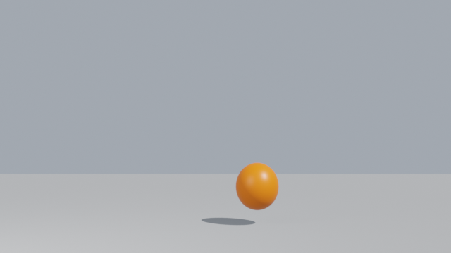
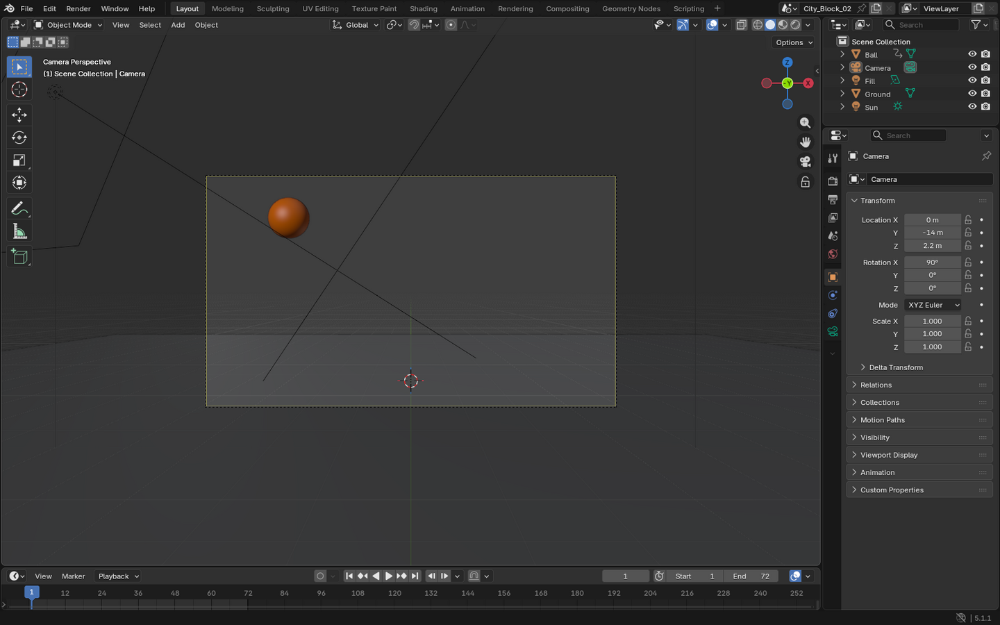

# Demo 3 — Animate live, render headless

Keyframe an animation in the open Blender session, save it, then render frames in a separate
background Blender process with `transport="headless"` so the UI stays responsive.

## Prompt

<!-- prompt:start -->
```text
Start from an empty Blender scene (delete everything that is there). Animate a bouncing ball: an orange
sphere that drops from 4 m onto a grey ground plane and bounces three times with decreasing height over
frames 1-72, with a little squash on each impact. Add a light and a side-on camera. Save the file as
/tmp/blender-mcp-demos/bouncing-ball.blend. Then, using the headless transport on that saved .blend file,
render frames 12, 24 and 40 with EEVEE at 640x360 to /tmp/blender-mcp-demos/03-frame-012.png,
03-frame-024.png and 03-frame-040.png (same folder). Keep the scene open in Blender and summarise.
```
<!-- prompt:end -->

## Result

| Frame 12 | Frame 24 | Frame 40 |
|---|---|---|
|  |  |  |



## Run it yourself, no AI

[`scripts/03_bouncing_ball.py`](scripts/03_bouncing_ball.py) builds the same kind of scene deterministically. It is plain
Blender Python, so you can also paste it into Blender's **Scripting** tab and press **Run**.

```bash
scripts/run_demo.sh 3                   # open Blender, build the scene and render it
scripts/run_demo.sh --background 3      # render only, no window
scripts/run_demo.sh --bridge 3          # send it to the Blender started by scripts/start.sh
scripts/run_demo.sh --background 3 --frames 1 16 40
```

Output: `/tmp/blender-mcp-demos/script-03-frame-*.png`. The `--bridge` mode runs the script through the same
`python.execute` command an AI's `blender_python_exec` call uses, which makes it a quick way to check
the bridge without an AI client.

## What the agent did

<!-- record:start -->
Recorded 2026-09-23 with **claude** `2.1.280 (Claude Code)` (model `claude-opus-5-5[1m]`). 4 Blender tool calls, 121 s end to end.

### Tool calls

1. `blender_python_exec` — Python, 125 lines
2. `blender_python_exec` `{"transport": "headless", "blend_file": "/tmp/blender-mcp-demos/bouncing-ball.blend", "timeout_seconds": 600}` — Python, 14 lines
3. `blender_python_exec` — Python, 33 lines
4. `blender_python_exec` `{"transport": "headless", "blend_file": "/tmp/blender-mcp-demos/bouncing-ball.blend", "timeout_seconds": 600}` — Python, 13 lines

<details><summary>Largest Python script the agent ran</summary>

```python
import bpy, math, os
from mathutils import Vector

# --- empty the scene ---
if bpy.context.object and bpy.context.object.mode != 'OBJECT':
    bpy.ops.object.mode_set(mode='OBJECT')
scene = bpy.context.scene
for ob in list(bpy.data.objects):
    bpy.data.objects.remove(ob, do_unlink=True)
for coll in list(scene.collection.children):
    bpy.data.collections.remove(coll)
for datablocks in (bpy.data.meshes, bpy.data.materials, bpy.data.lights, bpy.data.cameras, bpy.data.actions):
    for d in list(datablocks):
        if d.users == 0:
            datablocks.remove(d)

scene.frame_start, scene.frame_end = 1, 72
scene.render.fps = 24
scene.frame_set(1)

def mat(name, rgba, rough):
    m = bpy.data.materials.new(name)
    m.use_nodes = True
    b = m.node_tree.nodes["Principled BSDF"]
    b.inputs["Base Color"].default_value = rgba
    b.inputs["Roughness"].default_value = rough
    return m

# --- ground ---
bpy.ops.mesh.primitive_plane_add(size=30, location=(0, 0, 0))
ground = bpy.context.object; ground.name = "Ground"
ground.data.materials.append(mat("Grey", (0.35, 0.35, 0.35, 1), 0.8))

# --- ball (radius 0.5, resting centre z = 0.5) ---
R = 0.5
bpy.ops.mesh.primitive_uv_sphere_add(radius=R, segments=48, ring_count=24, location=(0, 0, 4))
ball = bpy.context.object; ball.name = "Ball"
bpy.ops.object.shade_smooth()
ball.data.materials.append(mat("Orange", (1.0, 0.35, 0.02, 1), 0.4))

# key list: (frame, x, z_centre, (sx, sy, sz), is_impact)
SQ = (1.25, 1.25, 0.70)     # squash on contact
ST = (0.92, 0.92, 1.15)     # slight stretch just before/after contact
N  = (1, 1, 1)
keys = [
    (1,  -3.0, 4.0,        N,  False),   # drop from 4 m
    (17, -1.4, None,       ST, False),
    (18, -1.3, R*SQ[2],    SQ, True),    # impact 1
    (20, -1.1, None,       ST, False),
    (30, -0.2, 2.4,        N,  False),   # bounce 1 peak
    (41,  0.8, None,       ST, False),
    (42,  0.9, R*SQ[2],    SQ, True),    # impact 2
    (44,  1.05, None,      ST, False),
    (51,  1.6, 1.3,        N,  False),   # bounce 2 peak
    (58,  2.1, None,       N,  False),
    (59,  2.2, R*0.8,      (1.15, 1.15, 0.8), True),  # impact 3 (smaller squash)
    (61,  2.35, None,      N,  False),
    (65,  2.6, 0.9,        N,  False),   # bounce 3 peak
    (69,  2.85, R,         N,  True),    # settles
    (72,  3.0, R,          N,  False),
]
for f, x, z, s, imp in keys:
    scene.frame_set(f)
    ball.location.x = x
    ball.keyframe_insert("location", index=0, frame=f)
    if z is not None:
        ball.location.z = z
        ball.keyframe_insert("location", index=2, frame=f)
    ball.scale = s
    ball.keyframe_insert("scale", frame=f)

# x: linear drift; z: eased at peaks, sharp (vector handles) at impacts
act = ball.animation_data.action
fcurves = act.fcurves if hasattr(act, "fcurves") else [fc for l in act.layers for s in l.strips for cb in s.channelbags for fc in cb.fcurves]
impact_frames = {f for f, *_r, imp in keys if imp}
for fc in fcurves:
    if fc.data_path == "location" and fc.array_index == 0:
        for kp in fc.keyframe_points: kp.interpolation = 'LINEAR'
    elif fc.data_path == "location" and fc.array_index == 2:
        for kp in fc.keyframe_points:
            kp.interpolation = 'BEZIER'
            if int(round(kp.co.x)) in impact_frames:
                kp.handle_left_type = kp.handle_right_type = 'VECTOR'
            else:
                kp.handle_left_type = kp.handle_right_type = 'AUTO_CLAMPED'
    fc.update()

# --- light ---
bpy.ops.object.light_add(type='SUN', location=(4, -6, 10))
sun = bpy.context.object; sun.name = "Sun"
sun.data.energy = 4.0
sun.rotation_euler = (math.radians(40), math.radians(20), math.radians(30))
bpy.ops.object.light_add(type='AREA', location=(-5, -6, 5))
fill = bpy.context.object; fill.name = "Fill"
fill.data.energy = 300; fill.data.size = 5
fill.rotation_euler = (Vector((0, 1.5, 1.5)) - fill.location).to_track_quat('-Z', 'Y').to_euler()

# --- side-on camera ---
bpy.ops.object.camera_add(location=(0, -14, 2.2), rotation=(math.radians(90), 0, 0))
cam = bpy.context.object; cam.name = "Camera"
cam.data.lens = 50
scene.camera = cam

# world
if scene.world is None:
    scene.world = bpy.data.worlds.new("World")
scene.world.use_nodes = True
bg = scene.world.node_tree.nodes.get("Background")
if bg: bg.inputs["Color"].default_value = (0.55, 0.62, 0.72, 1); bg.inputs["Strength"].default_value = 0.6

# render settings
eng = [e.identifier for e in bpy.types.RenderSettings.bl_rna.properties['engine'].enum_items]
scene.render.engine = 'BLENDER_EEVEE_NEXT' if 'BLENDER_EEVEE_NEXT' in eng else 'BLENDER_EEVEE'
scene.render.resolution_x, scene.render.resolution_y, scene.render.resolution_percentage = 640, 360, 100

scene.frame_set(1)
os.makedirs("/tmp/blender-mcp-demos", exist_ok=True)
bpy.ops.wm.save_as_mainfile(filepath="/tmp/blender-mcp-demos/bouncing-ball.blend")

samples = {}
for f in (1, 12, 18, 24, 30, 40, 42, 51, 59, 65, 72):
    scene.frame_set(f)
    samples[f] = [round(ball.location.x, 2), round(ball.location.z, 3), round(ball.scale.z, 2), round(ball.matrix_world.translation.z - R*ball.scale.z, 3)]
scene.frame_set(1)
__result__ = {"version": bpy.app.version_string, "engine": scene.render.engine, "objects": [o.name for o in scene.objects], "samples[x,z,sz,bottom]": samples, "file": bpy.data.filepath}
```

</details>

### Agent's reply

> The bouncing-ball scene is done. I emptied the scene first, and it's still open in your live Blender session. The three frames were rendered in a separate headless Blender process (5.1.1) from the saved .blend file.
>
> **Scene** (saved to `/tmp/blender-mcp-demos/bouncing-ball.blend`)
> - **Ground:** a 30 m grey plane at z = 0.
> - **Ball:** an orange sphere with a 0.5 m radius. It starts with its centre at 4 m, lands at frames 18, 42 and 59, and bounces back up to 2.4 m, 1.3 m and 0.9 m. It comes to rest around frame 69 and stays still until 72. It also drifts from x = −3 to +3 so the arcs read clearly from the side.
> - **Motion:** the height eases at the top of each arc and turns sharply at each landing. The x drift is at constant speed.
> - **Squash:** on the first two landings the ball stretches slightly on the way in, squashes to 70% height and 125% width, then recovers. The third landing has a smaller squash (80%). The ball's centre is lowered on those frames so its bottom stays exactly on the ground.
> - **Lights:** a sun light for shadows plus a soft area fill light, with a light blue-grey background.
> - **Camera:** looks straight at the scene from the side, 14 m away at 2.2 m height with a 50 mm lens. It's set as the active camera.
> - **Render settings:** EEVEE at 640×360, frames 1–72 at 24 fps.
>
> **Renders** (EEVEE, 640×360)
> - `/tmp/blender-mcp-demos/03-frame-012.png`: falling toward the first landing.
> - `/tmp/blender-mcp-demos/03-frame-024.png`: rising after the first bounce.
> - `/tmp/blender-mcp-demos/03-frame-040.png`: just before the second landing, slightly stretched.
>
> I looked at the first set of renders and fixed two things before rendering again. The ball stayed stretched through the whole fall, like an egg, so it now stays round except for a few frames around each landing. It also came out yellow, so I made the colour a deeper orange. The file you have open is the fixed version, and it matches the renders.
>
> "Drops from 4 m" means the ball's centre starts at 4 m, so its bottom is at 3.5 m. If you'd rather have the bottom of the ball at 4 m, I can raise the whole motion by 0.5 m.
<!-- record:end -->
